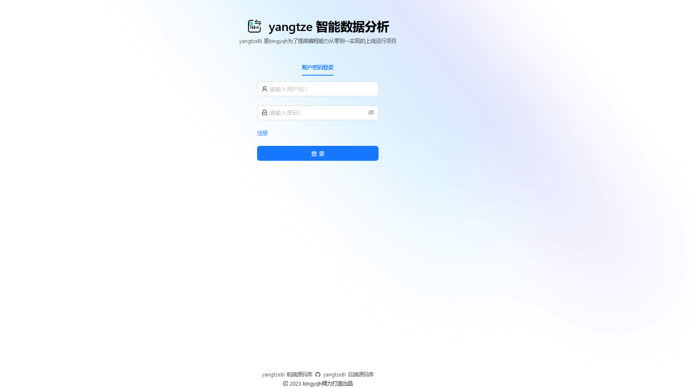
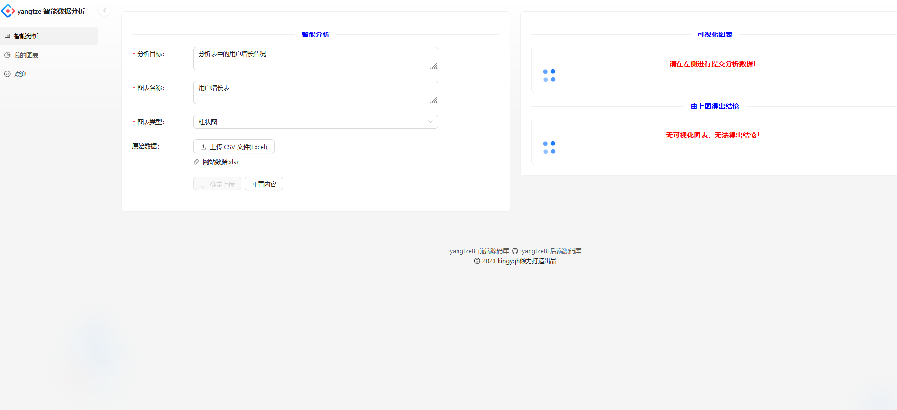
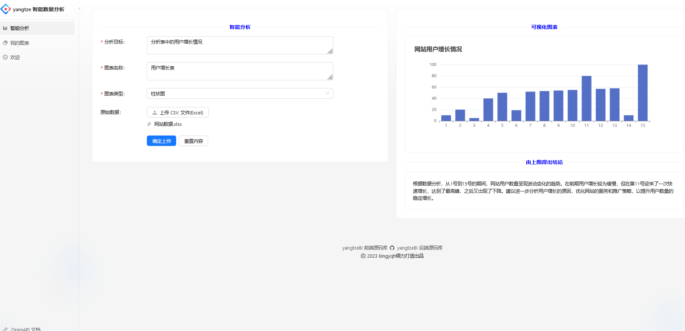
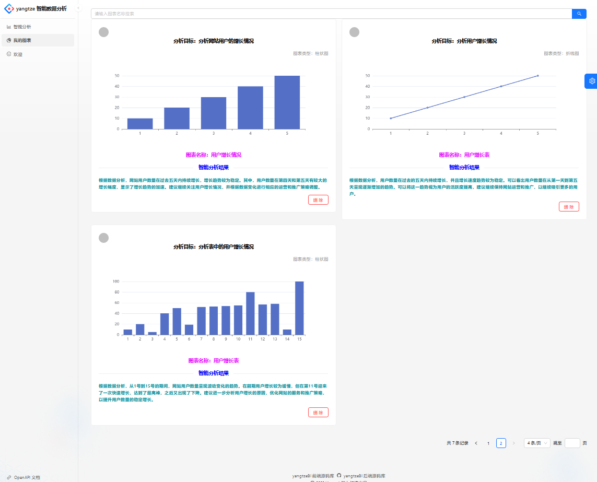
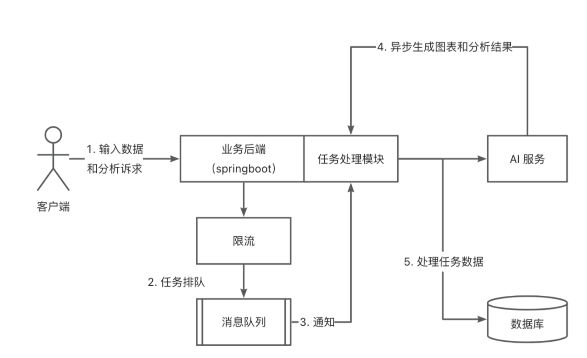
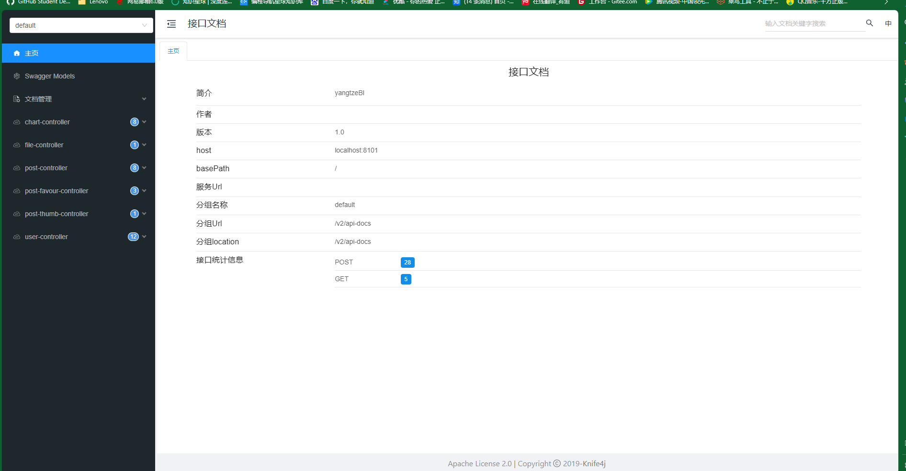

# yangtze - 智能数据分析项目

> 作者：kingYQH


## 项目简介

为企业提供简单高效数据分析的系统 —— `智能BI项目`

基于 React + Spring Boot + MQ + AIGC 的智能数据分析平台。
区别于传统 BI，用户只需要导入原始数据集、并输入分析诉求，就能自动生成可视化图表及分析结论，实现数据分析的降本增效.

登录页面：

数据智能分析页面：


图表展示管理页面：


## 智能BI业务流程

1. 用户输入原始数据
   - 分析目标
   - 上穿原始数据
   - 更精细的控制图表，比如图表类型，图表名称
2. 后端校验
   - 校验用户的输入是否合法（比如长度）
   - 成本控制（次数统计，鉴权等）
3. 把处理后的数据输入给AI模型（调用AI接口）==>  AI模型提供图表信息，结论文本 
4. 图表信息，结论文本在前端进行展示
5. 项目架构图：
   

## 项目核心接口
根据用户的输入（文本和文件），最后返回图表信息和结论文本

### 原始数据压缩
ai接口普遍都有输入字数限制，能够允许多传一些数据
如何像ai题词（prompt）？
- 持续输入持续优化

### 后端技术

- Spring Boot 2.7.2
- Spring MVC
- MyBatis + MyBatis Plus 数据访问（开启分页）
- Spring Boot 调试工具和项目处理器
- Spring AOP 切面编程
- Spring Scheduler 定时任务
- Spring 事务注解

### 数据存储

- MySQL 数据库
- Redis 内存数据库
- Elasticsearch 搜索引擎
- 腾讯云 COS 对象存储

### 工具类

- Easy Excel 表格处理
- Hutool 工具库
- Gson 解析库
- Apache Commons Lang3 工具类
- Lombok 注解

### 业务特性

- Spring Session Redis 分布式登录
- MySQL 数据库MyBatis-Plus 及 MyBatis X 自动生成
- Redis + Redisson 限流
- RabbitMQ 消息队列
- 鱼聪明 AI SDK（AI 能力）
- JDK 线程池及异步化
- Easy Excel 表格数据处理
- 全局请求响应拦截器（记录日志）
- 全局异常处理器
- 自定义错误码
- 封装通用响应类
- Swagger + Knife4j 接口文档
- 自定义权限注解 + 全局校验
- 全局跨域处理
- 长整数丢失精度解决
- 多环境配置

### 单元测试

- JUnit5 单元测试
- 示例单元测试类

### 架构设计

- 合理分层


### MySQL 数据库

1）修改 `application.yml` 的数据库配置为你自己的：

```yml
spring:
  datasource:
    driver-class-name: com.mysql.cj.jdbc.Driver
    url: jdbc:mysql://localhost:3306/my_db
    username: root
    password: 123456
```

2）执行 `sql/create_table.sql` 中的数据库语句，自动创建库表

3）启动项目，访问 `http://localhost:8101/api/doc.html` 即可打开接口文档，不需要写前端就能在线调试接口了~



### Redis 分布式登录

1）修改 `application.yml` 的 Redis 配置为你自己的：

```yml
spring:
  redis:
    database: 1
    host: localhost
    port: 6379
    timeout: 5000
    password: 123456
```

2）修改 `application.yml` 中的 session 存储方式：

```yml
spring:
  session:
    store-type: redis
```

3）移除 `MainApplication` 类开头 `@SpringBootApplication` 注解内的 exclude 参数：

修改前：

```java
@SpringBootApplication(exclude = {RedisAutoConfiguration.class})
```

修改后：


```java
@SpringBootApplication
```

### Elasticsearch 搜索引擎

1）修改 `application.yml` 的 Elasticsearch 配置：

```yml
spring:
  elasticsearch:
    uris: http://localhost:9200
    username: root
    password: 123456
```

